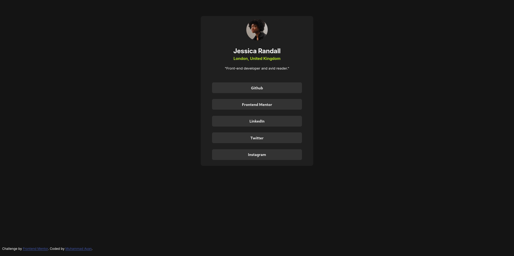

# Frontend Mentor - Social links profile solution

This is a solution to the [Social links profile challenge on Frontend Mentor](https://www.frontendmentor.io/challenges/social-links-profile-UG32l9m6dQ). Frontend Mentor challenges help you improve your coding skills by building realistic projects. 

## Table of contents

- [Overview](#overview)
  - [The challenge](#the-challenge)
  - [Screenshot](#screenshot)
  - [Links](#links)
- [My process](#my-process)
  - [Built with](#built-with)
  - [What I learned](#what-i-learned)
- [Author](#author)

## Overview

### The challenge

Users should be able to:

- See hover and focus states for all interactive elements on the page
- View the optimal layout for the interface depending on their device's screen size
- See responsive design from 320px up to 1440px viewport widths

### Screenshot



### Links

- Live Site URL: https://ayansid2323.github.io/frontend-social-links-card/
- Code URL: https://github.com/ayansid2323/frontend-social-links-card

### Built with

- Semantic HTML5 markup
- CSS custom properties
- Flexbox
- Mobile-first workflow
- Google Fonts (Inter)
- Custom color palette:
  - Green: hsl(75, 94%, 57%)
  - White: hsl(0, 0%, 100%)
  - Grey variations: hsl(0, 0%, 20%), hsl(0, 0%, 12%), hsl(0, 0%, 8%)

### What I learned

During this project, I learned how to:
- Structure a profile card using semantic HTML
- Implement responsive design using Flexbox
- Work with Google Fonts for typography
- Create interactive button states
- Build a clean and modern UI component
- Implement WCAG-compliant responsive design

Key HTML structure:

```html
<div class="main-container">
  <div class="image-container">
    <div id="image">
      
    </div>
  </div>
  <div class="text-container">
    <h2>Jessica Randall</h2>
    <p id="location">London, United Kingdom</p>
    <p>"Front-end developer and avid reader."</p>
  </div>
  <div class="button-container">
    <button>Github</button>
    <button>Frontend Mentor</button>
    <button>LinkedIn</button>
    <button>Twitter</button>
    <button>Instagram</button>
  </div>
</div>